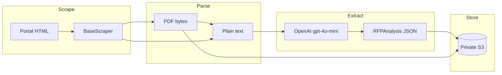

# k12-rfp-ai

[](LICENSE)
[](https://www.python.org/downloads/)
[](.github/workflows/scraper.yml)

**k12-rfp-ai** is an open-source, AI-driven crawler for U.S. K-12 EdTech RFPs. It scrapes public procurement portals, parses PDF and HTML solicitations, uses OpenAI Structured Outputs (`gpt-4o-mini`) to extract structured metadata, and stores JSON records and PDFs in a private AWS S3 bucket.

## Features

- Modular scrapers per state or district (`scrapers/`), including **TN** and **CA** district site crawlers
- PDF text extraction via `pypdf` / `pdfplumber`
- Structured extraction with Pydantic `RFPAnalysis` schemas
- S3 uploads with dated key prefixes (`rfps/` and `pdfs/`)
- Daily GitHub Actions workflow (AWS credentials via repository secrets)

## Quickstart

```bash
git clone https://github.com/classquip/k12-rfp-ai.git
cd k12-rfp-ai
python -m venv .venv
source .venv/bin/activate  # Windows: .venv\Scripts\activate
pip install -r requirements.txt
cp .env.example .env
# Edit .env with OPENAI_API_KEY and AWS settings
python main.py --all
# Or limit to one state (TN / CA district crawlers):
python main.py --state TN
python main.py --state CA
```

Relevant K-12 opportunities are printed as JSON to stdout. Set `SKIP_S3_UPLOAD=1` for local runs without AWS.

## Environment variables

| Variable | Required | Description |
|----------|----------|-------------|
| `OPENAI_API_KEY` | Yes (for extraction) | OpenAI API key for `gpt-4o-mini` structured parsing |
| `AWS_S3_BUCKET_NAME` | Yes (for uploads) | Private bucket for JSON and PDF artifacts |
| `AWS_REGION` | No | AWS region (default `us-east-1`) |
| `SKIP_S3_UPLOAD` | No | Set to `1` to disable S3 uploads locally |
| `MAX_OPPORTUNITIES_PER_SCRAPER` | No | Cap per run (default `10`) |

For GitHub Actions, configure **secrets** `OPENAI_API_KEY`, `AWS_ACCESS_KEY_ID`, `AWS_SECRET_ACCESS_KEY` and **variables** `AWS_S3_BUCKET_NAME`, `AWS_REGION`.

## AWS S3 layout

```
s3://your-bucket/
  rfps/2026-09-29/sample-k12-school-district_demo-edtech-lms.json
  pdfs/2026-09-29/sample-k12-school-district_demo-edtech-lms.pdf
```

JSON objects include the full `RFPAnalysis` payload plus `scraped_at` and optional `scraper_meta`.

## Architecture



## Project layout

```
schema.py              # Pydantic RFPAnalysis model
main.py                # CLI orchestrator
core/
  scraper.py           # Text gathering helpers
  parser.py            # PDF → text
  extractor.py         # OpenAI structured extraction
  s3_uploader.py       # boto3 uploads
scrapers/
  base.py              # Abstract BaseScraper
  district_sites.py    # Shared district crawl + PDF / Finalsite detection
  district_seeds.py    # Curated TN / CA district entry URLs
  tn_districts.py      # Tennessee district scraper
  ca_districts.py      # California district scraper
  sample_portal.py     # Legacy demo portal (BidNet landing page)
.github/workflows/
  scraper.yml          # Scheduled daily scrape
```

## Adding a new state scraper

1. Create `scrapers/your_state_xyz.py` extending `BaseScraper`.
2. Set `state_code` and `portal_name`; implement `fetch_opportunities()` and `download_document()`.
3. Register the class in `scrapers/__init__.py` (`SCRAPER_REGISTRY`).
4. Run `python main.py --state XX` and open a pull request with a short portal description.

Please respect each portal’s terms of use and rate limits; use identifiable `User-Agent` strings and conservative request volumes.

## License

This project is licensed under the [MIT License](LICENSE).

## Contributing

Issues and pull requests are welcome. For scrapers, include the public portal URL, target state, and notes on PDF vs HTML document patterns. Do not commit credentials or `.env` files.
